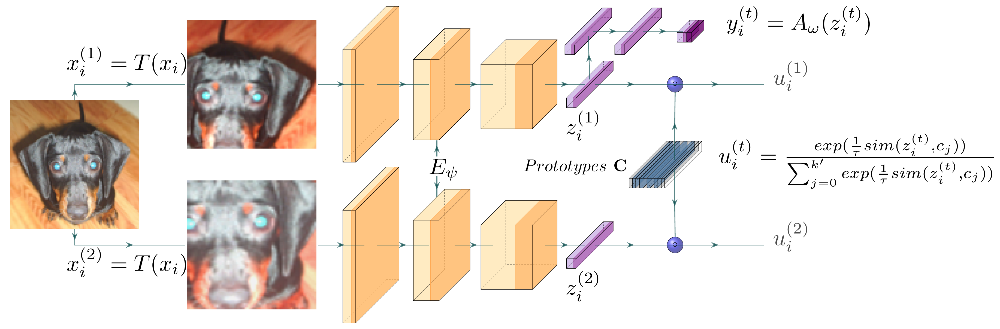

# Information Maximization Clustering via  Multi-View Self-Labelling

## Introduction
**This is implementation code written in Python (version 3.6.9) of IMC-SwAV based on manuscript [paper](https://arxiv.org/abs/2103.07368)
**

<tr>
<p align="center"> 
  
</p>
</tr>

## Performance

The reported performance of our proposed model is based on ResNet18 encoder architecture.<br>
We train our IMC-SwAV for 15 independent runs on training set, and we report the result of testing set only. 

### Average Performance

Table of average performance and the corresponding standard deviation.

Dataset | Acc | NMI | ARI
--- | --- | --- | ---
CIFAR-10|89.1  (±0.5) | 81.1  (±0.7)| 79.0 (±1.0)
CIFAR-20 | 49.0 (±1.8)| 50.3 (±1.2) | 33.7 (±1.3)
STL10| 83.1  (±1.0) | 72.9 (±0.9) | 68.5  (±1.4)
Tiny-Imagenet| 27.9  (±0.3) | 48.5 (±2.0) | 14.3  (±2.1)

### Best Performance

Below table reports the best recorded performance from our model.

Dataset | Acc | NMI | ARI
--- | --- | --- | ---
CIFAR-10|89.7 | 81.8| 80.0
CIFAR-20 | 51.9| 52.7 | 36.1
STL10| 85.3 | 74.7 | 71.6
Tiny-Imagenet| 28.2 | 52.6 | 14.6

Below, we report separate the result of our proposed IMC-SwAV in CIFAR-100 experiment (100 class)

Dataset | Top-1 ACC | Top-5 ACC | NMI | ARI
--- | --- | --- | --- | ---
CIFAR-100| 45.1 | 67.5 | 60.8 | 30.7

## Usage

All hyper parameters applied across all datasets (default setup/experiment) in the submission document as following:

Settings related with the multi-crop \
--nmb_crops 2 4 \
--max_scale_crops 1. 0.4 \
--min_scale_crops 0.2 0.08

Settings related with SwAV \
--tau 0.1 \
--eps 0.05 \
--project_dim 128 \
--prototypes 1000

Settings related to the training \
--learning_rate 0.0005 \
--warmup 500 <br> 
--l2_w 1e-5

Settings related to the dataset <br>
--path ROOT_DIRECTORY_OF_THE_DATASET (the path folder of the dataset)

To run any of the code, it is required the directory path of the dataset <br>
otherwise it will automatically download to './dataset'
#### CIFAR10

To run the training code.

```
python train.py --dataset C10 --path ./dataset --size_crops 28 18 \
      --output_dir ./c10 --cpt_name c10.cpt 
```

#### CIFAR20

To run the training code.

```
python train.py --dataset C20 --path ./dataset --size_crops 28 18  \
      --output_dir ./c20 --cpt_name c20.cpt
```

#### STL10

To run the training code.

```
python train.py --dataset STL10 --path ./dataset --size_crops 76 52 \
      --output_dir ./stl10 --cpt_name stl10.cpt --path ./dataset
```

#### CIFAR100

To run the training code.

```
python train.py --dataset C100 --path ./dataset --size_crops 28 18  --batch_size 512 \
      --output_dir ./c100 --cpt_name c100.cpt
```

#### Tiny-Imagenet

To run the training code.

```
python train.py --dataset tiny --path ./dataset --size_crops 56 36 --batch_size 512 \
      --output_dir ./tiny --cpt_name tiny.cpt
```
## The evaluation of the model.

##### Example evaluation on CIFAR10/20/100:

Through the argument '--cpt_load_path', it is parsed the full path of the stored model.

```
python test.py --dataset c10 --path ./dataset --size_crops 28 18 --cpt_load_path ./c10/imc_swav.cpt
```

```
python test.py --dataset c20 --path ./dataset --size_crops 28 18 --cpt_load_path ./c20/imc_swav.cpt
```

```
python test.py --dataset c100 --path ./dataset --size_crops 28 18 --cpt_load_path ./c100/imc_swav.cpt
```

##### Example evaluation on STL10:

```
python test.py --dataset STL10 --path ./dataset --size_crops 76 52 --cpt_load_path ./stl10/imc_swav.cpt
```

##### Example evaluation on Tiny-Imagenet:

```
python test.py --dataset tiny --path ./dataset --size_crops 56 36 --cpt_load_path ./tiny/tiny.cpt
```

## Notes

- During the training, each epoch reports the model's performance on test (validation set)
  and the training set (performance on training set is based on transformed instances).

- The classifier head is trained and evaluated only for labelled set on STL10 dataset. The unlabelled part of STL10 is
  used only to train the encoder and prototypes.

- All tests have been performed in Cuda version 10.1.

## Acknowledgement for reference repos
- [AMDIM](https://github.com/Philip-Bachman/amdim-public)
- [SwAV](https://github.com/facebookresearch/swav)

## Citation

```shell
@misc{ntelemis2021information,
      title={Information Maximization Clustering via Multi-View Self-Labelling}, 
      author={Foivos Ntelemis and Yaochu Jin and Spencer A. Thomas},
      year={2021},
      eprint={2103.07368},
      archivePrefix={arXiv},
      primaryClass={cs.CV}
}
```


